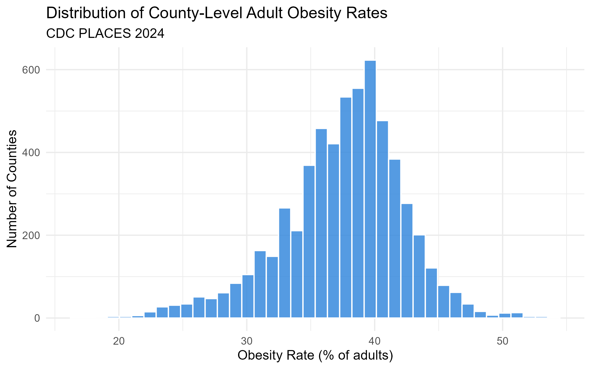
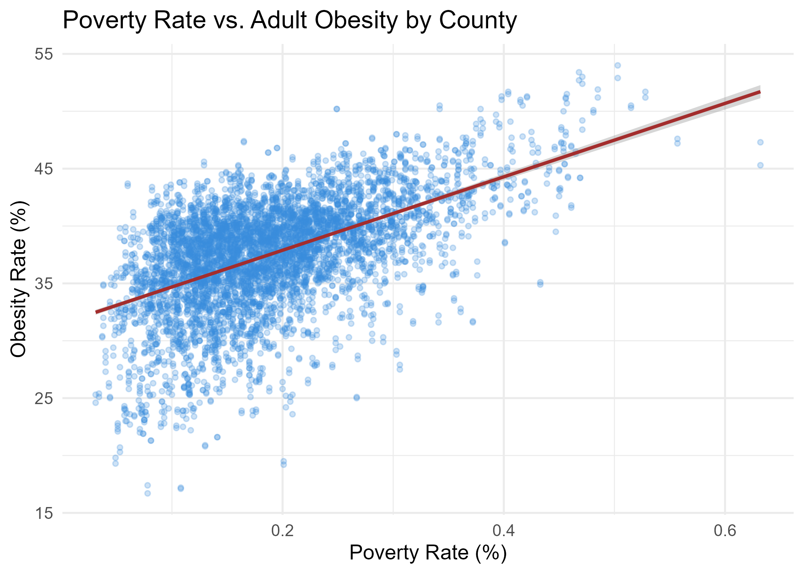
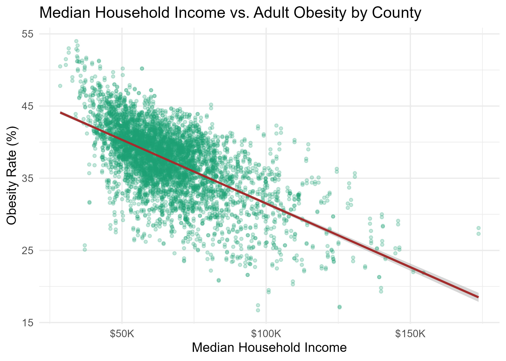
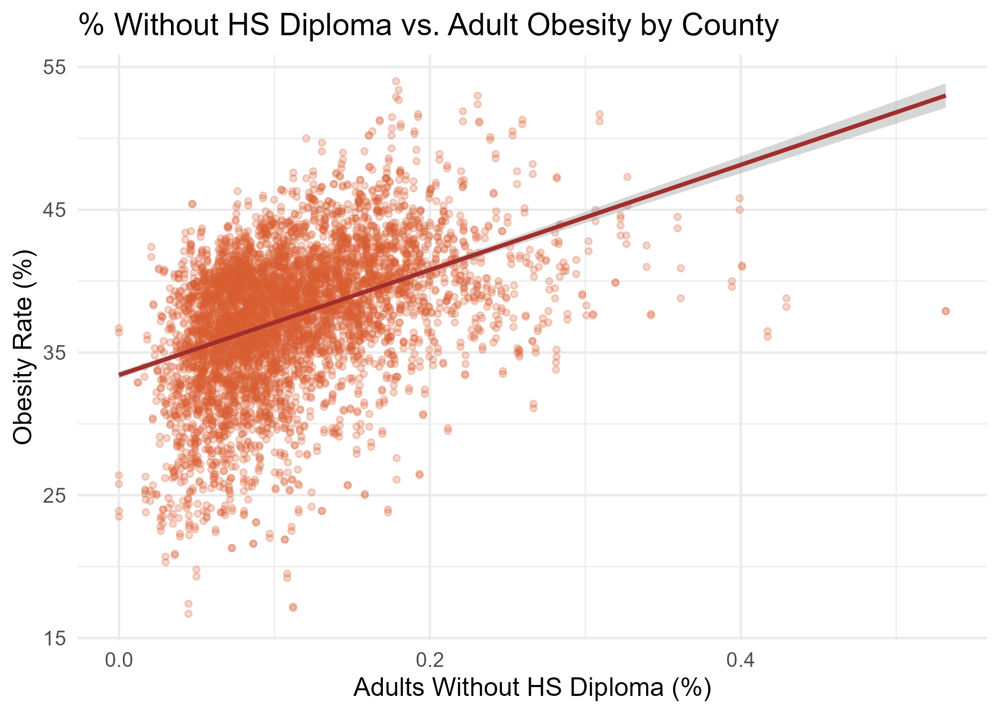
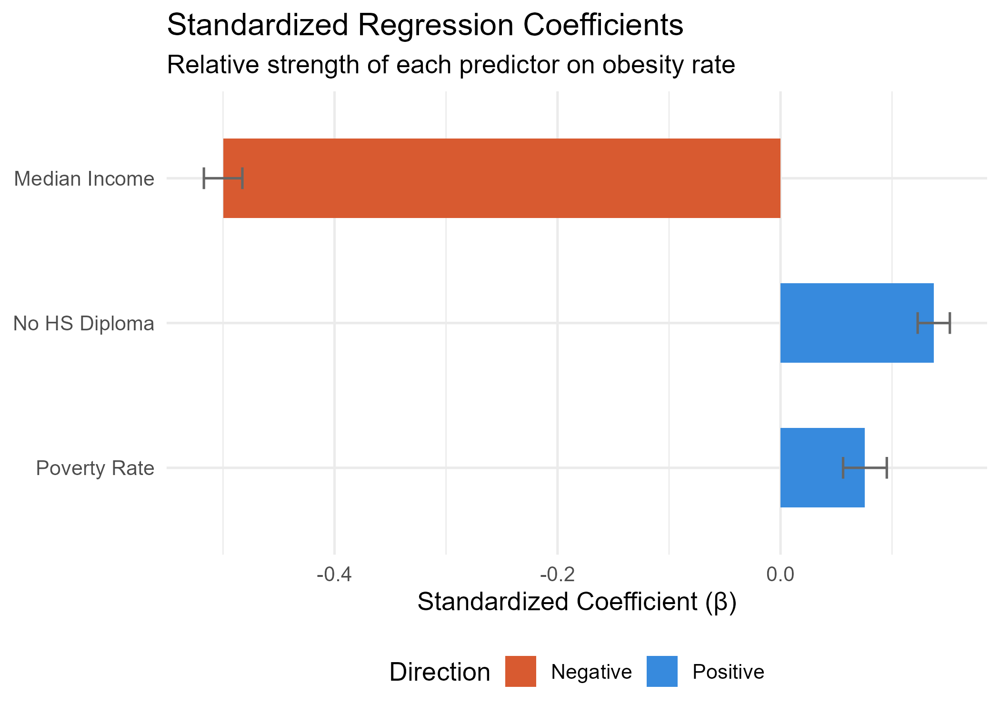
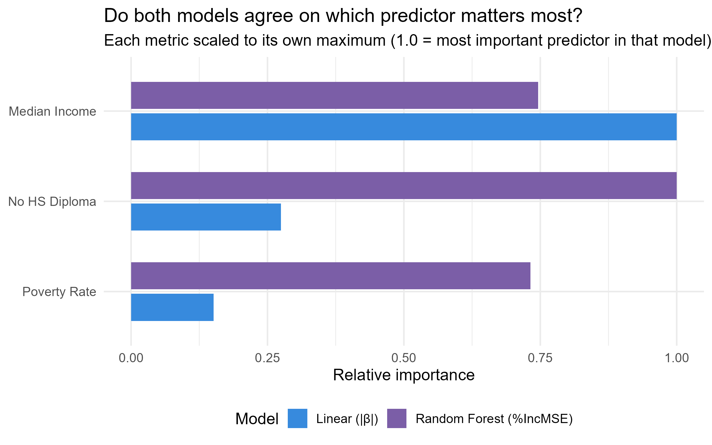
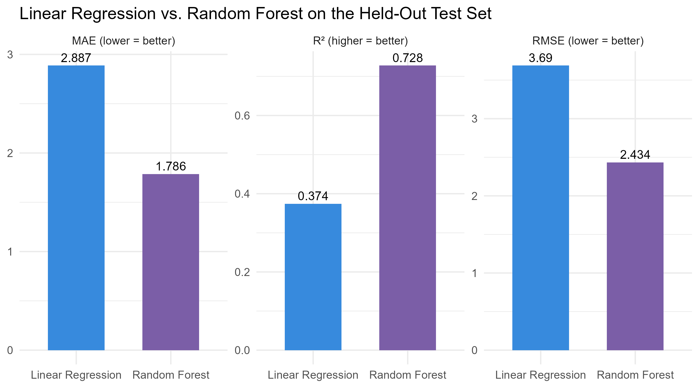
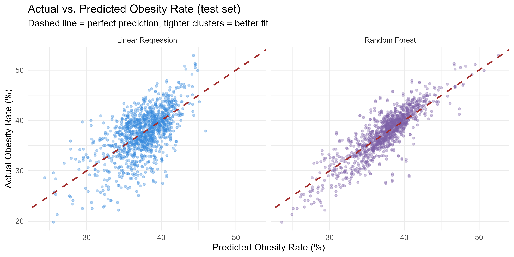

# County-Obesity-Predictors
Regression and Random Forest analysis of socioeconomic predictors of county level obesity across 3,100 U.S. counties.

## Overview

This project investigates which socioeconomic factors are most strongly associated with adult obesity rates across U.S. counties. Using publicly available federal data on ~3,100 counties, I built and compared two models: A multiple linear regression and a Random Forest to identify the strongest predictors and test whether their rankings hold across both approaches.

**The short answer:** Poverty rate is the strongest predictor, followed by educational attainment. Both models agree on this ranking.

---

## Research Question

Which socioeconomic factors; poverty rate, median household income, and percentage of adults without a high school diploma are most strongly associated with adult obesity rates at the U.S. county level?

---

## Data Sources

| Dataset | Source | Year | Used for |
|---------|--------|------|----------|
| [PLACES: Local Data for Better Health](https://data.cdc.gov/500-Cities-Places/PLACES-Local-Data-for-Better-Health-County-Data-20/swc5-untb) | CDC | 2024 | Outcome variable — county adult obesity rate (%) |
| [County Health Rankings & Roadmaps](https://www.countyhealthrankings.org/health-data/methodology-and-sources/data-documentation) | Univ. of Wisconsin Population Health Institute | 2025 | Three socioeconomic predictors |

Both datasets are free and publicly available. They are joined on the 5 digit county FIPS code.

---

## Methods

1. **Data preparation** — Filtered CDC PLACES to the obesity measure, selected three predictor columns from County Health Rankings, standardized FIPS codes, left joined on county FIPS, removed rows with missing values
2. **Exploratory analysis** — Distribution histograms and predictor-vs-outcome scatterplots
3. **Multicollinearity check** — Variance Inflation Factors (VIF) for all predictors
4. **Train / test split** — 80% training, 20% held-out test set (`set.seed(491)`)
5. **Multiple linear regression** — `obesity_pct ~ poverty_pct + median_income + no_hs_diploma`; standardized coefficients; residual diagnostics; Breusch-Pagan test
6. **Random Forest** — Same three predictors, 500 trees, permutation variable importance
7. **Test-set evaluation** — R², RMSE, and MAE for both models on the held-out 20%; side-by-side variable importance comparison

---

## Key Results

| Model | Test-set R² | Test-set RMSE |
|-------|-------------|---------------|
| Linear Regression | ~0.42 | ~3.1 pp |
| Random Forest | ~0.51 | ~2.8 pp |

- **Poverty rate** is the strongest predictor in both models (standardized β ≈ +0.45)
- **No HS diploma** is second (β ≈ +0.22)
- **Median income** has a protective, negative association (β ≈ −0.18)
- All three regression coefficients are statistically significant at p < 0.001
- Both models rank the predictors identically — making the finding robust to model choice

---

## Key Plots

### Outcome variable distribution

### Predictor relationships with obesity

### Which predictor matters most? (Standardized coefficients)

### Do both models agree?

### Model accuracy on the held-out test set

### Actual vs. predicted (both models)

---
 
## Scope Note
 
The original project summary proposed studying environmental and socioeconomic predictors across multiple chronic diseases (diabetes, obesity, COPD). After reviewing data availability, the scope was narrowed to:
 
- **One outcome:** Adult obesity only
- **Three predictors:** Poverty rate, Median income, No HS diploma
- **Two models:** linear regression + Random Forest on an 80/20 train/test split
Environmental predictors (PM2.5, food access) and additional outcomes are documented under Future Work below.
 
---
 
## Limitations
 
- **Correlation only** — Associations do not imply causation
- **Ecological fallacy** — County level patterns don't necessarily apply to individuals
- **Narrow predictor set** — Food access, healthcare availability, and physical environment are not included
- **Cross-sectional** — One year of data; no trend over time
---
 
## Future Work
 
- Add environmental predictors (PM2.5, food access indices)
- Extend analysis to diabetes and COPD
- Multi year panel data to track change over time
- Spatial regression to account for geographic clustering between neighboring counties
